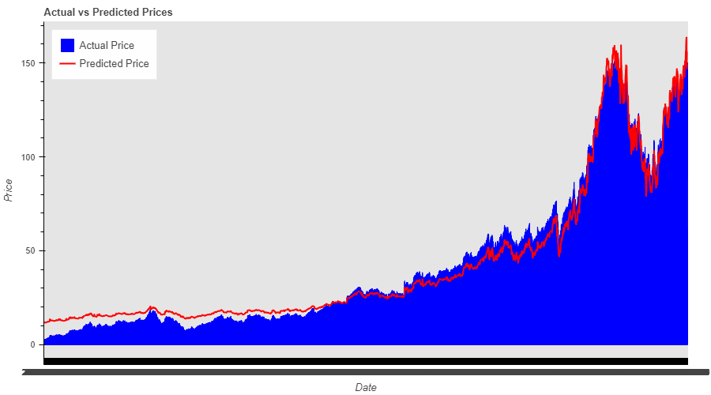
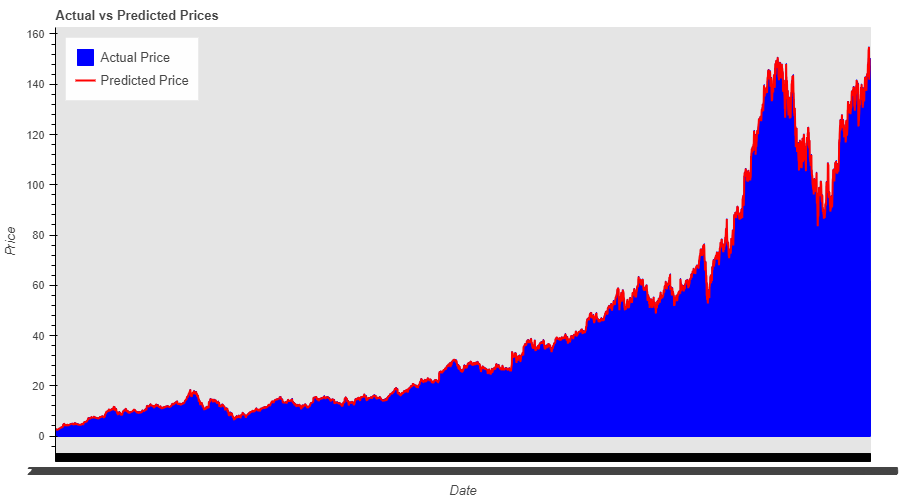

# Stock Price Prediction with LSTM Neural Network

## Overview

The main goal of this project is to employ a Long Short-Term Memory (LSTM) neural network for predicting stock values. The project focuses on developing a machine learning model that can predict stock values by utilizing past market data, and then comparing the actual values with the projected prices.

The project is divided into four sections:

### Section 1: Model Training

In this section, the Jupyter notebook file (`notebook.ipynb`) reads historical stock data of Google Inc. (now known as Alphabet Inc.) from a CSV file (`GOOG.csv`). The data is preprocessed, features are selected, and the data is divided into training and testing sets. An LSTM model is constructed using the TensorFlow Keras library and is trained on the training data. The trained model is then stored in the default Keras format.

- **Python Source File Name:** `train.py`

### Section 2: Prediction

This section loads the previously saved model to predict stock prices on a new dataset. The loaded LSTM model is used to make predictions on the new data, and metrics such as Mean Absolute Error (MAE) and Mean Squared Error (MSE) are computed and printed as output. The results are saved in a CSV file for visualization in Section 3.

- **Python Source File Name:** `predict.py`

### Section 3: Visualization

Utilizing the Bokeh library for interactive data visualization, this section loads the predicted results from the CSV file, creating a plot that compares actual and predicted stock prices over time.

- **Python Source File Name:** `visualization.py`

### Section 4: Predict Non-Existing Data

The final section predicts the stock price for a specific date. If the required data from the 'GOOG.csv' file is missing for that date, the script resorts to an alternative strategy, using the last ten rows of historical data to calculate an average as a placeholder. The pre-trained LSTM model is then used to predict the closing stock price.

- **Python Source File Name:** `non_existing_data.py`

## Why LSTM Neural Network?

A Long Short-Term Memory (LSTM) neural network is chosen due to its exceptional capacity to recognize and retain long-term relationships in sequential data. This makes LSTMs ideal for time-series forecasting applications, especially in capturing the complexities of stock price movements.

## Findings

The project's primary goal is to assess the model's performance in predicting stock prices using historical data from Alphabet Inc. Key findings based on different epoch settings are as follows:

| Number of Epochs | Mean Squared Error | Mean Absolute Error |
|-------------------|--------------------|----------------------|
| 5                 | 23.9718            | 4.3738               |
| 10                | 0.8661             | 0.6965               |
| 50                | 0.4988             | 0.3872               |
| 100               | 0.4066             | 0.3762               |
| 500               | 0.4578             | 0.4522               |
| 1000              | 0.0812             | 0.2099               |
| 5000              | 0.002              | 0.0115               |

<em>Figure 1: Actual vs Predicted Prices (most inaccurate 5 epochs model)</em>

<em>Figure 1: Actual vs Predicted Prices (most accurate 5000 epochs model)</em>

The findings demonstrate the LSTM's effectiveness in capturing the complexities of stock price movements and improving prediction accuracy over time. Increasing the number of epochs generally leads to improved model performance, but finding a balance between model accuracy and training duration is crucial.

